# ANT Task

*Behavioral Test*

To assess participants' executive functions, we employed the Attentional Network Task (ANT; Fan et al., 2002; 2009), a paradigm designed to evaluate attentional focus capacity. In a sequence of trials, participants were instructed to promptly indicate the direction (left or right) of a target arrow presented on a computer screen. The target arrow was flanked by additional arrows that could either all align in the same direction as the target (congruent condition) or diverge in the opposite direction (incongruent condition). Furthermore, in certain trials, advance cues provided information about the timing and/or location of the impending target.

Participants underwent this task on four occasions: prior to entering the scanner (Run "1_out"), within the scanner (Run "2_in"), inside the scanner with the added noise from an EPI sequence (Run "3_in_noise"), and outside the scanner (Run "4_out"). Evaluations outside the scanner were conducted in a soundproofed room, with participants seated before a computer screen displaying the stimuli. Within the scanner, stimuli were visible through a mirror mounted on the head antenna, with projections onto an LCD screen positioned at the rear of the scanner.


Refs: 

Fan, Jin, Bruce D. McCandliss, Tobias Sommer, Amir Raz, and Michael I. Posner. 2002. “Testing the Efficiency and Independence of Attentional Networks.” J Cogn Neurosci 14 (3): 340–47. https://doi.org/10.1162/089892902317361886.

Fan, Jin, Xiaosi Gu, Kevin G. Guise, Xun Liu, John Fossella, Hongbin Wang, and Michael I. Posner. 2009. “Testing the Behavioral Interaction and Integration of Attentional Networks.” Brain and Cognition 70 (2): 209–20. https://doi.org/10.1016/j.bandc.2009.02.002.


# Individual participants' global performance (hit rates and average reaction-times)

Participants labeled 1 to 21 belong to the control group (no field), participants above 22 (included) belong to the experimental group (exposed to 11.7T).


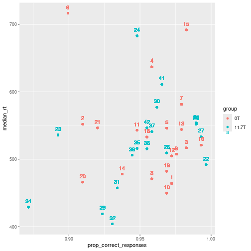


Proportion of errors and slow responses to be removed for the analyses of reaction-times:


```
## [1] "Excluding 582 data points out of 11232 ( 5.2 %) (errors or slow responses)"
```

##  Focus on Reaction-Times 
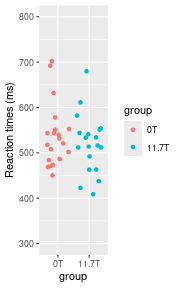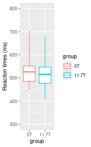

```
## 
## 	Welch Two Sample t-test
## 
## data:  individualRTs$median_rt by individualRTs$group
## t = 0.8, df = 37, p-value = 0.4
## alternative hypothesis: true difference in means between group 0T and group 11.7T is not equal to 0
## 95 percent confidence interval:
##  -25.8  61.7
## sample estimates:
##    mean in group 0T mean in group 11.7T 
##                 538                 520
```

## Focus on hit rates (percentage correct responses)

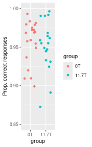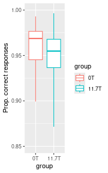

```
## 
## 	Welch Two Sample t-test
## 
## data:  perf$prop_correct by perf$group
## t = 0.6, df = 33, p-value = 0.6
## alternative hypothesis: true difference in means between group 0T and group 11.7T is not equal to 0
## 95 percent confidence interval:
##  -0.0147  0.0258
## sample estimates:
##    mean in group 0T mean in group 11.7T 
##               0.957               0.951
```

## Performance of each group (group 1 = 0T, group2 = 11.7T) 


```r
print(psych::describeBy(perf, group="group"), digits=5)
```

```
## 
##  Descriptive statistics by group 
## group: 1
##              vars  n   mean     sd median trimmed   mad   min    max   range
## subject_id      1 20 10.500 5.9161 10.500   10.50 7.413 1.000 20.000 19.0000
## group           2 20  1.000 0.0000  1.000    1.00 0.000 1.000  1.000  0.0000
## prop_correct    3 20  0.957 0.0276  0.969    0.96 0.018 0.899  0.993  0.0938
##                skew kurtosis      se
## subject_id    0.000   -1.381 1.32288
## group           NaN      NaN 0.00000
## prop_correct -0.807   -0.726 0.00617
## ------------------------------------------------------------ 
## group: 2
##              vars  n   mean     sd median trimmed    mad    min    max  range
## subject_id      1 18 29.889 5.7690 29.500  29.875 7.4130 21.000 39.000 18.000
## group           2 18  2.000 0.0000  2.000   2.000 0.0000  2.000  2.000  0.000
## prop_correct    3 18  0.951 0.0333  0.955   0.954 0.0257  0.872  0.997  0.125
##                 skew kurtosis      se
## subject_id    0.0523   -1.461 1.35976
## group            NaN      NaN 0.00000
## prop_correct -0.7034   -0.038 0.00784
```

# Run effect on reaction times

How do reaction time evolve from run 1 to 4 ? We expect that participants may get faster with time as they are more and more trained. The main question is: is the 11.7T group going to be slowed down than the 0T group when they are inside the scanner (and maybe also after) ?

Remark: because the stimulation conditions are not exactly the same in and out of the scanner, we do not expect the RTs to be the same in run2 & 3 than in run 1 & 4 (after removing the training effect). 

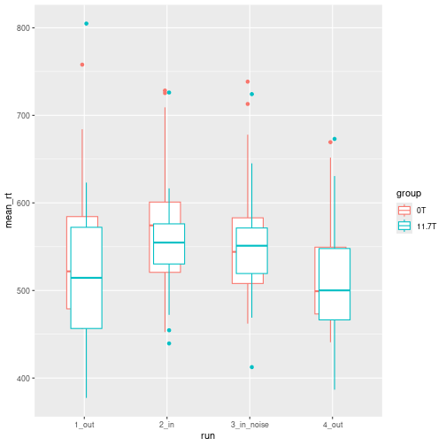

```
##          run group  N mean   sd   se   ci
## 1      1_out    0T 20  545 82.7 18.5 38.7
## 2      1_out 11.7T 19  527 96.5 22.1 46.5
## 3       2_in    0T 20  575 78.2 17.5 36.6
## 4       2_in 11.7T 19  554 64.0 14.7 30.8
## 5 3_in_noise    0T 20  559 76.6 17.1 35.8
## 6 3_in_noise 11.7T 19  550 68.5 15.7 33.0
## 7      4_out    0T 20  519 65.3 14.6 30.5
## 8      4_out 11.7T 19  510 69.5 15.9 33.5
```

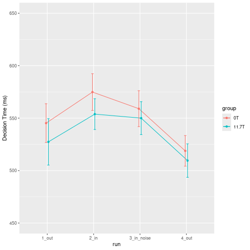

# Focus on the Flanker congruency effet (inhibition function)

The participants must classify the direction of the central arrow.
The neighboring arrows can point toward the same direction ("congruent" condition), or the opposite direction ("incongruent" condition).
The difference in performance between the incongruent and the congruent conditions (the "flanker cost") measures how well the participant can "focus" his/her attention on the central arrow, inhibiting the influence of the irrelevant flanking arrows.


```r
runeffect <- allc %>% 
  group_by(subject_id, run, group, flanker_congruency) %>%  
  summarize(mean_rt = mean(reaction_time, na.rm=TRUE))
```

```
## `summarise()` has grouped output by 'subject_id', 'run', 'group'. You can
## override using the `.groups` argument.
```

```r
runs <- summarySE(runeffect, measurevar="mean_rt", groupvars=c("run", "group", "flanker_congruency"))

pd <- position_dodge(0.001) 
ggplot(runs, aes(x=run, y=mean, color= flanker_congruency)) + 
      geom_point(position=pd) +
      geom_line(aes(group = flanker_congruency), position=pd) + 
      geom_errorbar(aes(ymin=mean-se, ymax=mean+se, color=flanker_congruency), width=.1, position=pd) +
      facet_wrap(~group) + ylim(350, 750) + ylab("Reaction-times (ms)")
```

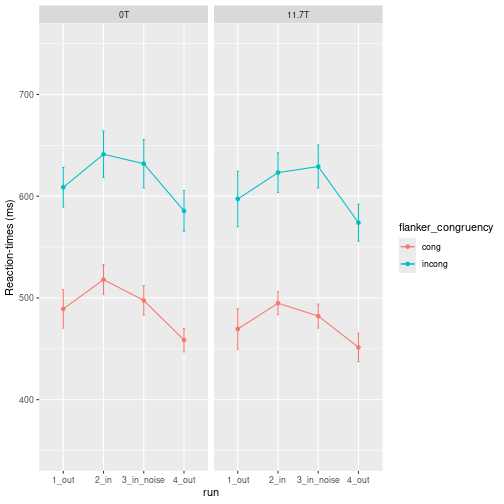

```r
runs2 <- reshape(runs, idvar=c("run", "group"), timevar="flanker_congruency", direction = "wide")

runs2$cost  <- runs2$mean.incong - runs2$mean.cong

pd <- position_dodge(0.1) 
ggplot(runs2, aes(x=run, y=cost, colour = group), show.legend = FALSE) +  
  geom_point(position=pd) + 
  geom_line(aes(group=group), position=pd) +
  geom_errorbar(aes(ymin=cost-se.incong, ymax=cost+se.incong), width=.1, position=pd) + 
  ylim(0, 250) + 
  ylab("Flanker cost (ms)")
```

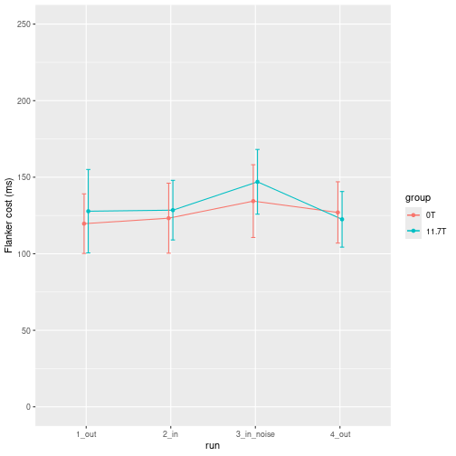


## Analysis of Variance Group*Run*Flanker_congruency 


```r
rt_mod <- aov_car(mean_rt ~ group + Error(subject_id/flanker_congruency * run), data=runeffect)
```

```
## Contrasts set to contr.sum for the following variables: group
```

```r
knitr::kable(nice(rt_mod))
```


|Effect                       |df          |MSE      |F          |ges   |p.value |
|:----------------------------|:-----------|:--------|:----------|:-----|:-------|
|group                        |1, 37       |43570.87 |0.33       |.007  |.567    |
|flanker_congruency           |1, 37       |4854.37  |266.18 *** |.392  |<.001   |
|group:flanker_congruency     |1, 37       |4854.37  |0.12       |<.001 |.736    |
|run                          |2.21, 81.64 |2006.16  |27.89 ***  |.058  |<.001   |
|group:run                    |2.21, 81.64 |2006.16  |0.40       |<.001 |.690    |
|flanker_congruency:run       |2.55, 94.21 |488.73   |3.01 *     |.002  |.042    |
|group:flanker_congruency:run |2.55, 94.21 |488.73   |0.61       |<.001 |.581    |


\newpage

# Stabilometry


*Method*: Before and after participants entered the scanner, their static balance was assessed. They stepped for 10s  (TODO: Check duration), first with their eyes open, then with eyes closed, on a plateform (AbilyCareTODO: insert REF) that computed a stability score (ranging from 0 to 99).   

*Result*: Whether the stability test was taken with eyes opened or with eyes closed, all participants from both groups stayed in the normal stability range (90-99). Moreover, there was no significant nor sizeable effect of exposure to the scanner, nor any difference between the control (0T) and  the experimental (11.7T) groups (see below for average groups scores and the relevant t-tests). 


## individual data

Test conditions (O1, O2, C1, C2):

* O = Eyes Opened
* C = Eyes Closed
* 1 = before entering the scanner
* 2 = after exisiting the scanner


The score represents the probability of belonging to a "normal" group of people without balance issues.

According to an AbilyCare company internal test, a group of people with balance issues had a average score of 40. 

I selected 50-90 on the y scale. No participant was below 90.


```r
ggplot(equill, aes(x=test, y=score, color=group, fill=group)) + geom_col() + facet_wrap(~subject_id) + coord_cartesian(ylim = c(50, 100))
```

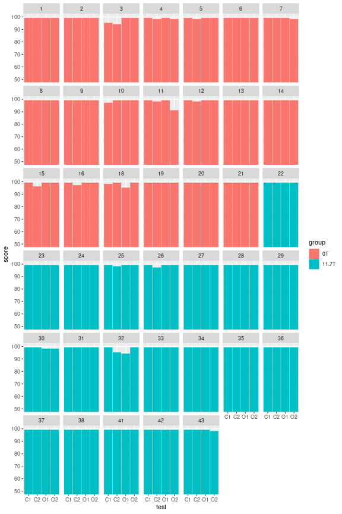


## Group analysis

```r
summary(equilibre)
```

```
##    subject_id     group          O1             C1             O2      
##  Min.   : 1.0   0T   :20   Min.   :94.0   Min.   :95.0   Min.   :91.0  
##  1st Qu.:10.8   11.7T:20   1st Qu.:99.0   1st Qu.:99.0   1st Qu.:99.0  
##  Median :21.5              Median :99.0   Median :99.0   Median :99.0  
##  Mean   :21.2              Mean   :98.8   Mean   :98.8   Mean   :98.7  
##  3rd Qu.:31.2              3rd Qu.:99.0   3rd Qu.:99.0   3rd Qu.:99.0  
##  Max.   :43.0              Max.   :99.0   Max.   :99.0   Max.   :99.0  
##        C2      
##  Min.   :94.0  
##  1st Qu.:98.8  
##  Median :99.0  
##  Mean   :98.5  
##  3rd Qu.:99.0  
##  Max.   :99.0
```

```r
ggplot(equill, aes(x=test, y=score, color=group)) + geom_boxplot() + ylim(50, 100)
```

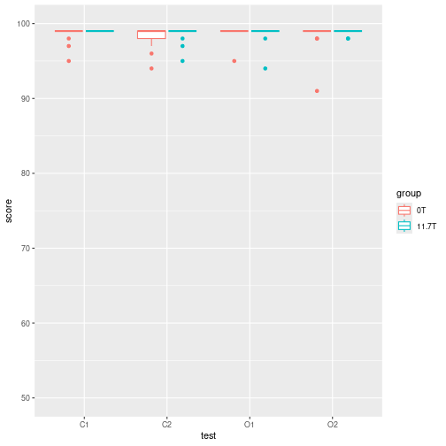

```r
balance_group = summarySE(equill, "score", c("group", "test")) %>% mutate("score" = mean)
pd = position_dodge(0.1)
ggplot(balance_group, aes(x=test, y=score, color=group)) + geom_point() + geom_line() +  geom_errorbar(aes(ymin=score-se, ymax=score+se), width=.1, position=pd) + ylim(90, 100)
```

```
## `geom_line()`: Each group consists of only one observation.
## ℹ Do you need to adjust the group aesthetic?
```

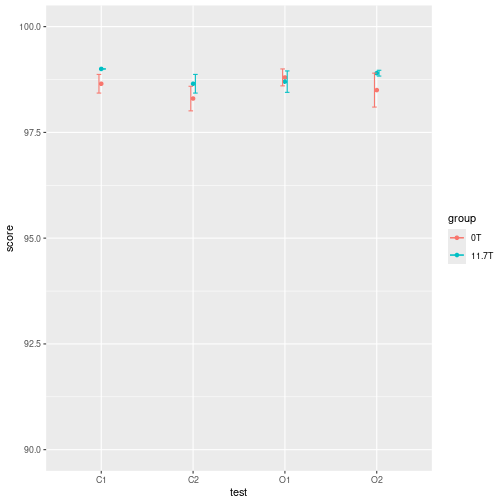


### Analysis of Variance  Group * Test (O1,O2,C1,C2)

```
##   group test  N mean    sd     se    ci score
## 1    0T   C1 20 98.7 0.988 0.2209 0.462  98.7
## 2    0T   C2 20 98.3 1.302 0.2911 0.609  98.3
## 3    0T   O1 20 98.8 0.894 0.2000 0.419  98.8
## 4    0T   O2 20 98.5 1.792 0.4007 0.839  98.5
## 5 11.7T   C1 20 99.0 0.000 0.0000 0.000  99.0
## 6 11.7T   C2 20 98.7 0.988 0.2209 0.462  98.7
## 7 11.7T   O1 20 98.7 1.129 0.2524 0.528  98.7
## 8 11.7T   O2 20 98.9 0.308 0.0688 0.144  98.9
```

```
## Contrasts set to contr.sum for the following variables: group
```


|Effect     |df          |MSE  |F    |ges  |p.value |
|:----------|:-----------|:----|:----|:----|:-------|
|group      |1, 38       |1.51 |1.66 |.014 |.206    |
|test       |2.38, 90.53 |1.26 |0.91 |.016 |.422    |
|group:test |2.38, 90.53 |1.26 |0.55 |.010 |.610    |


\newpage

# Physiological Variables

## Fréquence Cardiaque (FC)


```r
fc = bind_cols(select(physio, c("Rang", "group")), select(physio, contains("FC")))
fcl = pivot_longer(fc, -(1:2))
ggplot(fcl, aes(x=name, y=value, group=Rang, color=group)) + geom_point() + geom_line(aes(group=Rang)) +geom_text(aes(label=Rang, hjust=2), position=position_dodge())
```

```
## Warning: Width not defined
## ℹ Set with `position_dodge(width = ...)`
```

```
## Warning: Removed 49 rows containing missing values or values outside the scale
## range (`geom_point()`).
```

```
## Warning: Removed 8 rows containing missing values or values outside the scale
## range (`geom_line()`).
```

```
## Warning: Removed 49 rows containing missing values or values outside the scale
## range (`geom_text()`).
```

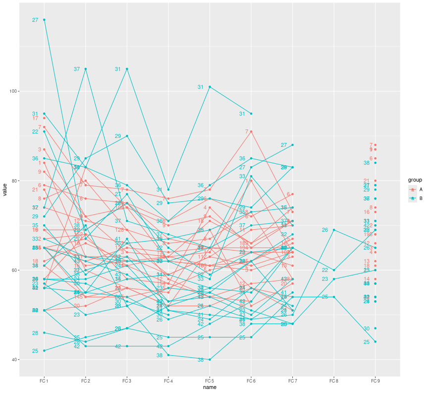

## Taux de saturation en oxygène (SpO2)


```r
spo2 = bind_cols(select(physio, c("Rang", "group")), select(physio, contains("SpO2")))
spo2l = pivot_longer(spo2, -(1:2))
ggplot(spo2l, aes(x=name, y=value, group=Rang, color=group)) + geom_point() + geom_line(aes(group=Rang)) +geom_text(aes(label=Rang, hjust=2), position=position_dodge())
```

```
## Warning: Width not defined
## ℹ Set with `position_dodge(width = ...)`
```

```
## Warning: Removed 51 rows containing missing values or values outside the scale
## range (`geom_point()`).
```

```
## Warning: Removed 8 rows containing missing values or values outside the scale
## range (`geom_line()`).
```

```
## Warning: Removed 51 rows containing missing values or values outside the scale
## range (`geom_text()`).
```

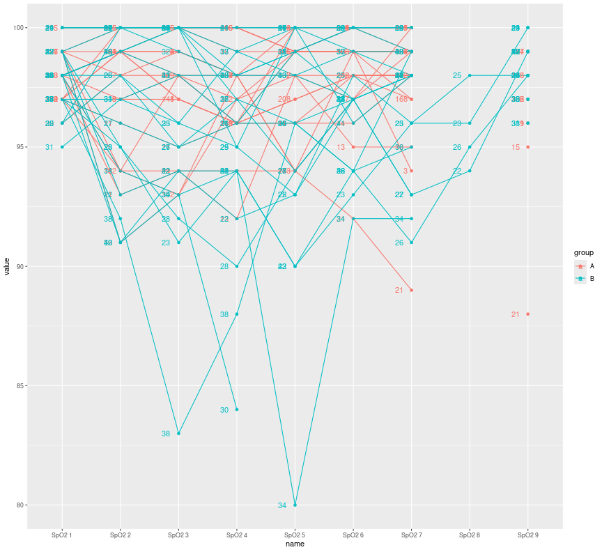

## Pression artérielle systolique (PAS)


```r
pas = bind_cols(select(physio, c("Rang", "group")), select(physio, contains("PAS")))
pasl = pivot_longer(pas, -(1:2))
ggplot(pasl, aes(x=name, y=value, group=Rang, color=group)) + geom_point() + geom_line(aes(group=Rang)) +geom_text(aes(label=Rang, hjust=2), position=position_dodge())
```

```
## Warning: Width not defined
## ℹ Set with `position_dodge(width = ...)`
```

```
## Warning: Removed 46 rows containing missing values or values outside the scale
## range (`geom_point()`).
```

```
## Warning: Removed 8 rows containing missing values or values outside the scale
## range (`geom_line()`).
```

```
## Warning: Removed 46 rows containing missing values or values outside the scale
## range (`geom_text()`).
```

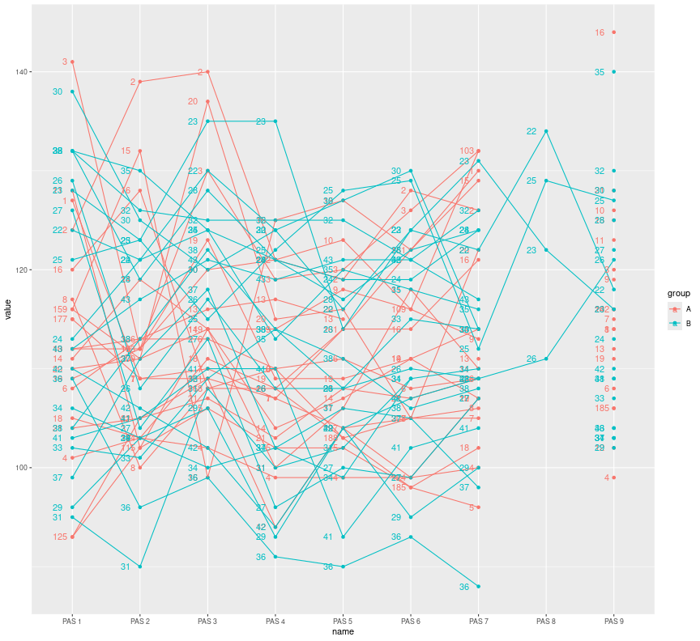

## Pression Artérielle Dystolique (PAD)


```r
pad = bind_cols(select(physio, c("Rang", "group")), select(physio, contains("PAD")))
padl = pivot_longer(pad, -(1:2))
ggplot(padl, aes(x=name, y=value, group=Rang, color=group)) + geom_point() + geom_line(aes(group=Rang)) +geom_text(aes(label=Rang, hjust=2), position=position_dodge())
```

```
## Warning: Width not defined
## ℹ Set with `position_dodge(width = ...)`
```

```
## Warning: Removed 46 rows containing missing values or values outside the scale
## range (`geom_point()`).
```

```
## Warning: Removed 8 rows containing missing values or values outside the scale
## range (`geom_line()`).
```

```
## Warning: Removed 46 rows containing missing values or values outside the scale
## range (`geom_text()`).
```

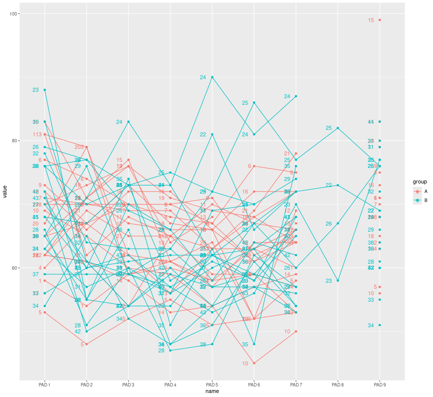

## Température


```r
temp = bind_cols(select(physio, c("Rang", "group")), select(physio, contains("Temp")))
templ = pivot_longer(temp, -(1:2))
ggplot(templ, aes(x=name, y=value, group=Rang, color=group)) + geom_point() + geom_line(aes(group=Rang)) +geom_text(aes(label=Rang, hjust=2), position=position_dodge())
```

```
## Warning: Width not defined
## ℹ Set with `position_dodge(width = ...)`
```

```
## Warning: Removed 2 rows containing missing values or values outside the scale
## range (`geom_point()`).
```

```
## Warning: Removed 2 rows containing missing values or values outside the scale
## range (`geom_line()`).
```

```
## Warning: Removed 2 rows containing missing values or values outside the scale
## range (`geom_text()`).
```

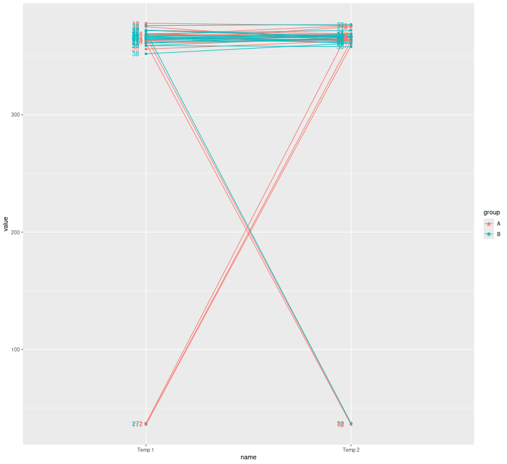
